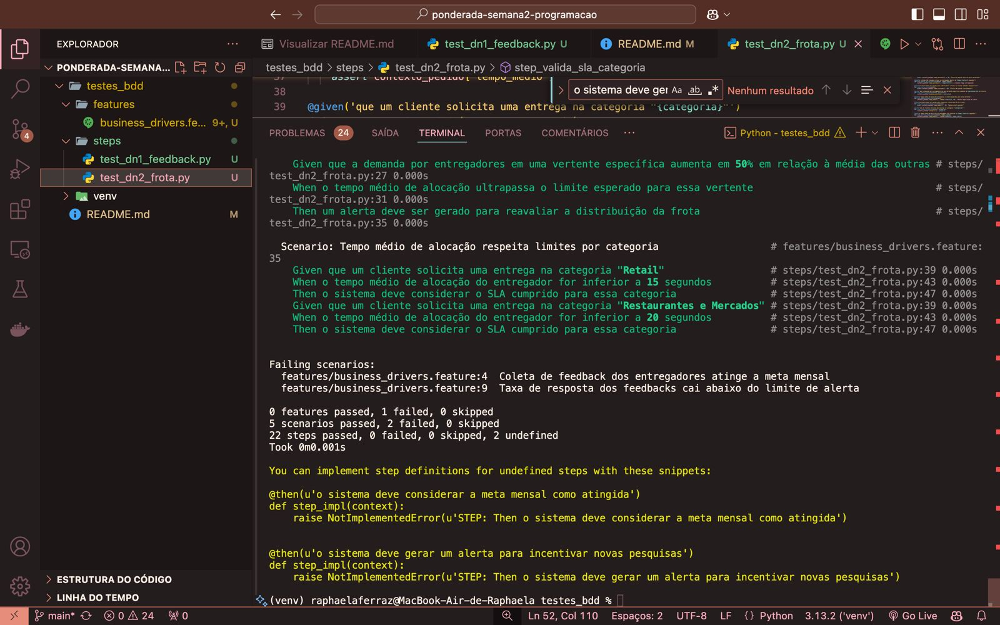

# Mapa do Business Drivers

*DN1 - Experiência do Entregador e Feedback Estruturado*
- Requisito: O sistema deve oferecer um mecanismo nativo de feedback dentro do app, garantindo que pelo menos 50% dos entregadores ativos forneçam feedback mensalmente.
- Métrica: Respostas aos formulários devem ser coletadas automaticamente e analisadas com base em tendências de churn e insatisfação.
- Monitoramento: Se a taxa de resposta cair abaixo de 30%, um alerta deve ser gerado para incentivar novas pesquisas.

*DN2 - Eficiência e Distribuição da Frota do Turbo 10*
- Requisito: A distribuição da frota do Turbo 10 deve garantir que 95% dos pedidos sejam atribuídos a um entregador dentro de 30 segundos após a solicitação.
- Métrica: O tempo médio de alocação de entregador deve ser inferior a 15 segundos para pedidos de Retail. Para Restaurantes e Mercados, o tempo médio de alocação não pode ultrapassar 20 segundos. Se mais de 5% dos pedidos permanecerem sem entregador por mais de 60 segundos, um alerta deve ser disparado.
- Monitoramento: O sistema deve rastrear e ajustar automaticamente a frota com base na demanda por vertente (Retail, Restaurante, Mercado). Caso uma vertente específica tenha um tempo de alocação 50% maior que a média das outras, um alerta deve ser gerado para reavaliar a distribuição da frota.

# Estratégia 
A *carga de trabalho em tempo real* e o workload é a mais adequado para atender ambos os business drivers, DN1 e DN2, pois envolve o processamento imediato de informações com baixa latência, garantindo respostas rápidas para ações críticas no sistema. No caso do DN2, a alocação de entregadores precisa acontecer em até 30 segundos, exigindo um sistema que processe múltiplos pedidos simultaneamente, encontre o entregador mais adequado e distribua a carga de forma otimizada, tudo isso em tempo real. Além disso, para evitar gargalos operacionais, o monitoramento da frota deve ajustar dinamicamente a distribuição conforme a demanda, garantindo um equilíbrio entre as diferentes vertentes de serviço (Retail, Restaurantes e Mercados). Já para o DN1, a coleta e análise de feedbacks dos entregadores também devem ocorrer em tempo real, permitindo que o sistema identifique rapidamente padrões de insatisfação e tendências de churn, acionando medidas corretivas antes que problemas escalem. A geração de alertas imediatos caso a taxa de resposta dos feedbacks caia abaixo de 30% reforça a necessidade de uma abordagem de baixa latência para a análise de dados, garantindo que ações corretivas possam ser implementadas rapidamente. Dessa forma, a carga de trabalho em tempo real é essencial para garantir tanto a eficiência operacional da frota quanto a experiência contínua dos entregadores, permitindo um sistema responsivo, dinâmico e proativo na gestão de entregas e satisfação dos colaboradores.

# Massa de testes 
```
Feature: Validação dos Business Drivers do AppTurbo10

  # DN1 - Experiência do Entregador e Feedback Estruturado
  Scenario: Coleta de feedback dos entregadores atinge a meta mensal
    Given que há 1000 entregadores ativos na plataforma
    When pelo menos 500 entregadores enviam feedback dentro do mês
    Then o sistema deve considerar a meta mensal como atingida

  Scenario: Taxa de resposta dos feedbacks cai abaixo do limite de alerta
    Given que há 1000 entregadores ativos na plataforma
    When menos de 300 entregadores enviam feedback dentro do mês
    Then o sistema deve gerar um alerta para incentivar novas pesquisas

  Scenario: Análise de feedback detecta aumento na insatisfação dos entregadores
    Given que os feedbacks recebidos apresentam notas abaixo de 3.0 em uma escala de 5
    When a média da nota dos feedbacks estiver abaixo do valor mínimo aceitável
    Then o sistema deve gerar um relatório de tendências e sugerir ações corretivas

  # DN2 - Eficiência e Distribuição da Frota do Turbo 10
  Scenario: Atribuição de entregador ocorre dentro do tempo esperado
    Given que um cliente solicita uma entrega via AppTurbo10
    When o sistema aloca um entregador em menos de 30 segundos
    Then o pedido deve ser considerado como atendido dentro do SLA

  Scenario: Alerta gerado para pedidos sem alocação de entregador
    Given que um cliente solicita uma entrega via AppTurbo10
    When o sistema não consegue alocar um entregador dentro de 60 segundos
    Then um alerta deve ser gerado para redistribuir a frota ou acionar medidas emergenciais

  Scenario: Ajuste dinâmico da frota baseado na demanda
    Given que a demanda por entregadores em uma vertente específica aumenta em 50% em relação à média das outras
    When o tempo médio de alocação ultrapassa o limite esperado para essa vertente
    Then um alerta deve ser gerado para reavaliar a distribuição da frota

  Scenario: Tempo médio de alocação respeita limites por categoria
    Given que um cliente solicita uma entrega na categoria "Retail"
    When o tempo médio de alocação do entregador for inferior a 15 segundos
    Then o sistema deve considerar o SLA cumprido para essa categoria

    Given que um cliente solicita uma entrega na categoria "Restaurantes e Mercados"
    When o tempo médio de alocação do entregador for inferior a 20 segundos
    Then o sistema deve considerar o SLA cumprido para essa categoria

```

# Codificação
Para realizar a codificação desses business drivers, usando a massa de teste apresentada acima, optei por Cucumber com Python (Behave). 
Sugestão de pastas para rodar:
```
/testes_bdd
│── features/
│   ├── business_drivers.feature  # Arquivo Gherkin acima
│   ├── steps/
│   │   ├── test_dn1_feedback.py   # Testes para DN1
│   │   ├── test_dn2_frota.py      # Testes para DN2
```

Código do DN1:
```
from behave import given, when, then
import random

entregadores_ativos = 1000
feedbacks = []

@given('que há {total_entregadores:d} entregadores ativos na plataforma')
def step_define_entregadores(context, total_entregadores):
    context.total_entregadores = total_entregadores

@when('pelo menos {meta_feedback:d} entregadores enviam feedback dentro do mês')
def step_recebe_feedback_sucesso(context, meta_feedback):
    context.feedbacks_recebidos = meta_feedback

@then('o sistema deve registrar que a meta mensal de feedback foi atingida')
def step_valida_meta_feedback(context):
    assert context.feedbacks_recebidos >= context.total_entregadores * 0.5, "Meta não atingida!"


@when('menos de {limite_feedback:d} entregadores enviam feedback dentro do mês')
def step_recebe_feedback_alerta(context, limite_feedback):
    context.feedbacks_recebidos = limite_feedback

@then('o sistema deve alertar para incentivar novas pesquisas')
def step_verifica_alerta_feedback(context):
    if context.feedbacks_recebidos < context.total_entregadores * 0.3:
        context.alerta_gerado = True
    else:
        context.alerta_gerado = False
    assert context.alerta_gerado, f"Alerta não foi gerado corretamente! ({context.feedbacks_recebidos}/{context.total_entregadores})"

@given('que os feedbacks recebidos apresentam notas abaixo de {limite_nota:f} em uma escala de 5')
def step_feedback_negativo(context, limite_nota):
    context.media_feedbacks = limite_nota - 0.5  

@when('a média da nota dos feedbacks estiver abaixo do valor mínimo aceitável')
def step_verifica_media_feedback(context):
    context.feedback_negativo = context.media_feedbacks < 3.0

@then('o sistema deve gerar um relatório de tendências e sugerir ações corretivas')
def step_gera_relatorio_feedback(context):
    assert context.feedback_negativo, "Nenhum relatório gerado, pois a média não está abaixo do limite!"

```

Código para o DN2:
```
from behave import given, when, then
import random

# Mockando tempos de alocação
contexto_pedido = {}

@given('que um cliente solicita uma entrega via AppTurbo10')
def step_pedido_realizado(context):
    contexto_pedido['status'] = 'pendente'

@when('o sistema aloca um entregador em menos de {tempo_limite:d} segundos')
def step_pedido_atribuido(context, tempo_limite):
    contexto_pedido['tempo_alocacao'] = random.randint(5, tempo_limite)  # Mocka um tempo entre 5s e o limite

@then('o pedido deve ser considerado como atendido dentro do SLA')
def step_verifica_sla(context):
    assert contexto_pedido['tempo_alocacao'] <= 30, "Alocação demorou mais do que o permitido!"

@when('o sistema não consegue alocar um entregador dentro de {tempo_limite:d} segundos')
def step_pedido_sem_atribuicao(context, tempo_limite):
    contexto_pedido['tempo_alocacao'] = tempo_limite + 1  # Simula tempo ultrapassado

@then('um alerta deve ser gerado para redistribuir a frota ou acionar medidas emergenciais')
def step_alerta_frota(context):
    assert contexto_pedido['tempo_alocacao'] > 60, "Alerta não gerado corretamente!"

@given('que a demanda por entregadores em uma vertente específica aumenta em {percentual:d}% em relação à média das outras')
def step_aumento_demanda(context, percentual):
    contexto_pedido['demanda_aumentada'] = percentual

@when('o tempo médio de alocação ultrapassa o limite esperado para essa vertente')
def step_demanda_acima_limite(context):
    contexto_pedido['tempo_medio'] = random.randint(21, 50)  # Mocka tempo acima do limite

@then('um alerta deve ser gerado para reavaliar a distribuição da frota')
def step_alerta_reavaliacao_frota(context):
    assert contexto_pedido['tempo_medio'] > 20, "Nenhum alerta gerado!"

@given('que um cliente solicita uma entrega na categoria "{categoria}"')
def step_categoria_pedido(context, categoria):
    contexto_pedido['categoria'] = categoria

@when('o tempo médio de alocação do entregador for inferior a {tempo_limite:d} segundos')
def step_verifica_tempo_medio(context, tempo_limite):
    contexto_pedido['tempo_medio'] = random.randint(5, tempo_limite)

@then('o sistema deve considerar o SLA cumprido para essa categoria')
def step_valida_sla_categoria(context):
    if contexto_pedido['categoria'] == "Retail":
        assert contexto_pedido['tempo_medio'] <= 15, "Tempo acima do permitido para Retail!"
    elif contexto_pedido['categoria'] in ["Restaurantes", "Mercados"]:
        assert contexto_pedido['tempo_medio'] <= 20, "Tempo acima do permitido para Restaurantes e Mercados!"
```

# Resultado do código
imagem: 

